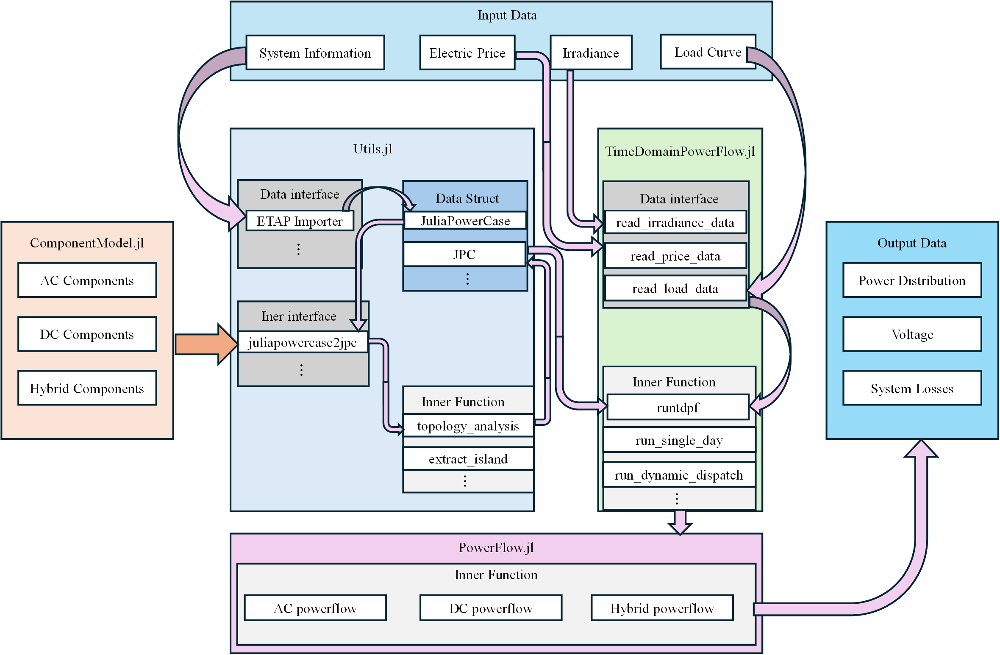

# HyDistFlow Framework Overview

HyDistFlow is a comprehensive power system analysis framework developed in Julia, focusing on modeling, simulation, and optimization of modern power systems. The framework supports traditional AC systems, DC systems, and hybrid AC/DC systems analysis, providing rich tools to address modern power system challenges including renewable energy integration, carbon emission assessment, and time-series analysis.

## Framework Structure

The HyDistFlow framework consists of four core modules, each focusing on different aspects of power system analysis:

1. **ComponentModel** - Power system component modeling
2. **Utils** - Utility tools and helper functions
3. **PowerFlow** - Power flow calculation algorithms
4. **TimeDomainPowerFlow** - Time-series power flow analysis

These modules work together to provide a complete solution from basic component modeling to advanced time-series analysis.

## Software Framework Diagram



## Key Features

- **Comprehensive Component Modeling** - Support for all major power system components in AC, DC, and hybrid systems
- **Multiple Power Flow Algorithms** - Including Newton-Raphson, DC power flow, and hybrid power flow calculations
- **Time-Series Analysis** - Support for dynamic dispatch and long-term system behavior analysis
- **Renewable Energy Integration** - Specialized models for PV systems and energy storage systems
- **Carbon Emission Assessment** - Built-in carbon emission models for environmental impact analysis
- **High-Performance Computing** - GPU acceleration for large-scale system analysis

## Module Details

### ComponentModel Module

The ComponentModel module provides a comprehensive framework for modeling and simulating power systems, including AC, DC, and hybrid AC/DC components, as well as carbon emission models.

**Key Features:**
- AC component modeling (Bus, Line, Transformer, Generator, Load)
- DC component modeling (DCBus, DCLine, DCGenerator, DCLoad, Storage)
- Converter modeling (Converter)
- Hybrid AC/DC system modeling
- Carbon emission models

ComponentModel supports the creation of various power system models from simple single-bus systems to complex hybrid AC/DC grids. It provides an object-oriented API that allows users to intuitively build and manipulate power system models.

### Utils Module

The Utils module provides utility functions for power system analysis, including data conversion, network topology analysis, and various helper functions for working with power system models.

**Key Features:**
- Data conversion functions (external/internal indexing conversion)
- Network topology analysis (island detection, node mapping)
- Data extraction and format conversion
- ETAP data import
- Indexing constants and data structures

The Utils module serves as the infrastructure of the framework, providing core functionality for handling power system data and models, simplifying the development and use of other modules.

### PowerFlow Module

The PowerFlow module provides comprehensive power flow analysis capabilities for electrical power systems. It includes implementations of various power flow algorithms including AC Newton-Raphson, DC power flow, and hybrid power flow for integrated AC/DC systems.

**Key Features:**
- AC Newton-Raphson power flow calculation
- DC power flow analysis
- Hybrid AC/DC power flow calculation
- Unbalanced power flow analysis
- GPU-accelerated computations
- ZIP load model support
- Results processing and reporting

The PowerFlow module is the core analysis engine of the framework, providing multiple algorithms to solve different types of power flow problems, from traditional AC systems to modern hybrid AC/DC systems.

### TimeDomainPowerFlow Module

The TimeDomainPowerFlow module provides tools and functions for time-series power flow analysis, including dynamic dispatch, voltage profile analysis, and renewable integration.

**Key Features:**
- Time-series power flow analysis
- Dynamic dispatch optimization
- Voltage profile analysis
- Renewable energy integration
- Visualization capabilities

The TimeDomainPowerFlow module extends traditional power flow analysis to handle time-varying system states, which is crucial for analyzing modern power system challenges such as renewable energy integration and demand response.

## Application Scenarios

The TimeDomainPowerFlow framework is suitable for various power system analysis scenarios:

1. **Traditional Power System Analysis** - Power flow calculation, fault analysis, and stability studies
2. **Renewable Energy Integration** - Assessing the impact of renewable sources like PV and wind on the system
3. **Hybrid AC/DC System Design** - Optimizing HVDC transmission and hybrid microgrids
4. **Energy Storage System Planning** - Analyzing the performance and economics of large-scale energy storage systems
5. **Carbon Emission Assessment** - Evaluating environmental impacts and emission reduction strategies
6. **Time-Series Optimization** - Operational scheduling optimization based on time-varying carbon intensity

## Technical Features

- **High-Performance Computing** - Leveraging Julia's high-performance characteristics and GPU acceleration
- **Modular Design** - Clear module structure for easy extension and customization
- **Comprehensive Documentation** - Detailed API documentation and usage examples
- **Open-Source Ecosystem** - Seamless integration with Julia's scientific computing ecosystem

## Usage Example

Below is an example of using the HyDistFlow framework for basic power flow analysis:

```julia
using HyDistFlow

# Create power system model
case = JuliaPowerCase()

# Add AC buses
bus1 = Bus(1, "Bus 1", 110.0, "b", 1, 1.0, 0.0)
bus2 = Bus(2, "Bus 2", 110.0, "pq", 1, 1.0, 0.0)
push!(case.busesAC, bus1)
push!(case.busesAC, bus2)

# Add generator
gen = StaticGenerator(1, "Gen 1", 1, 100.0, 20.0, 1.0, 150.0, 50.0, 50.0, -50.0)
push!(case.sgensAC, gen)

# Add line
line = Line(1, "Line 1-2", 1, 2, 10.0, 0.1, 0.3, 10.0, 0.5, 1.0, 1)
push!(case.branchesAC, line)

# Add load
load = Load(1, "Load 1", 2, 50.0, 10.0, 1.0, "wye")
push!(case.loadsAC, load)

# Convert to JPC format
jpc = JuliaPowerCase2Jpc(case)

# Set power flow options
opt = PowerFlow.settings()
opt[:pf_alg] = :NR  # Newton-Raphson algorithm
opt[:verbose] = 1

# Run power flow
results = PowerFlow.runpf(jpc, opt)

# Process results
PowerFlow.process_result(results, case, opt)
```

## Conclusion

The HyDistFlow framework provides a comprehensive and efficient solution for modeling, simulating, and optimizing modern power systems. By combining Julia's high-performance characteristics with advanced power system analysis algorithms, the framework can handle a wide range of challenges from traditional AC systems to complex hybrid AC/DC systems. Whether for basic research, education, or engineering applications, HyDistFlow provides powerful and flexible tools to meet the needs of power system analysis.